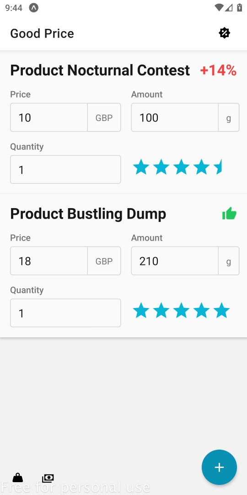
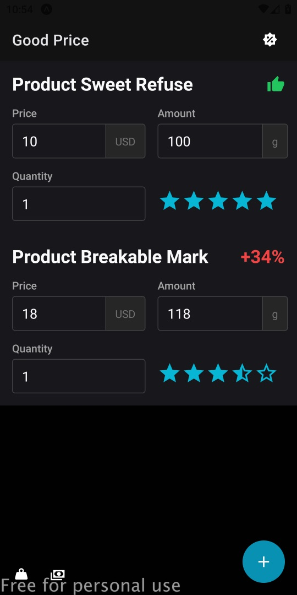

# GoodPrice

[](https://github.com/ayltai/GoodPrice/actions)
[](https://sonarcloud.io/dashboard?id=ayltai_GoodPrice)
[](https://sonarcloud.io/dashboard?id=ayltai_GoodPrice)
[](https://sonarcloud.io/dashboard?id=ayltai_GoodPrice)
[](https://sonarcloud.io/dashboard?id=ayltai_GoodPrice)
[](https://sonarcloud.io/dashboard?id=ayltai_GoodPrice)
[](https://sonarcloud.io/dashboard?id=ayltai_GoodPrice)
[](https://sonarcloud.io/dashboard?id=ayltai_GoodPrice)
[](https://sonarcloud.io/dashboard?id=ayltai_GoodPrice)


[](https://github.com/ayltai/GoodPrice/releases)
[](https://github.com/ayltai/GoodPrice/blob/master/LICENSE)

The forgotten shopping tool - using unit pricing is the [best](https://eprints.qut.edu.au/221392/) way for shoppers to save money on grocery shopping!

## Features
* Identifies the cheapest item
* Shows the percentage difference for all items
* Supports automatic conversion of quantity of different units
* Supports area, length, time, volume, and weight units
* Supports automatic conversion of different currencies
* Supports offline mode

## Supported units
| Type   | Units                                                |
|--------|------------------------------------------------------|
| Area   | m², cm², ft², in², ym², mm², km², mi²                |
| Length | mm, m, cm, ft, in, ym, km, mi                        |
| Time   | min, hour, day, week, month, year                    |
| Volume | m³, cm³, ft³, in³, ml, L, oz, oz (US), gal, gal (US) |
| Weight | mg, g, kg, lb, oz, oz (US), tonne, tonne (US)        |

## Screenshots



## Development
1. Install [NodeJS](https://nodejs.org)
2. Install dependencies
   ```shell
   npm i --legacy-peer-deps
   ```
3. Install Expo CLI
   ```shell
   npm i -g expo-cli
   ```
4. Install EAS CLI
   ```shell
   npm i -g eas-cli
   ```

## Configurations

### (Optional) Open Exchange Rates API
1. Get an API key from [Open Exchange Rates](https://openexchangerates.org/signup)
2. Specify the API key for getting the latest currency rates
   ```shell
   export API_KEY_OPEN_EXCHANGE_RATES=XXXXX
   ```

### Run
Open a terminal window and run:
```shell
npm start
```

### Build
Open a terminal window and run:
```shell
npm run build
```

## License
This project is licensed under the terms of the [MIT license](https://github.com/ayltai/GoodPrice/blob/LICENSE).
